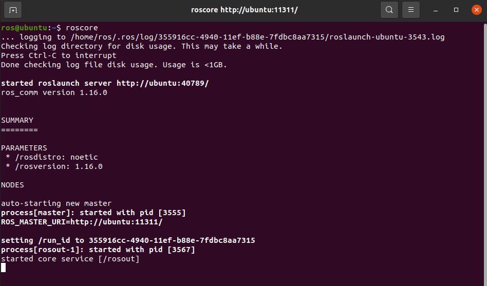

<h1 align="center">Robótica</h1>
Bienvenido al repositorio del curso de Robótica Industrial. Este curso está diseñado para estudiantes e investigadores interesados en el campo de la robótica y cubre desde conceptos básicos de cinemática y trayectorías con ROS Noetic.

## Estructura del Repositorio

Este repositorio está organizado de la siguiente manera:

- `logos/`: Carpeta que contiene los logos relacionados con el curso.
- `código/`: Ejemplos de código fuente en Python para diferentes módulos del curso.
- `README.md`: Este archivo, que proporciona una visión general y guía sobre el repositorio.

## Instalación de ROS Noetic
El objetivo de la presente práctica es instalar y configurar el entorno de trabajo de ROS Noetic en Ubuntu 20.04.6, empleando una máquina virtual con VMWorkStation Player 17.

## Recursos Adicionales

Para complementar tu aprendizaje en el curso de Mobile Robot, aquí tienes algunos enlaces a recursos externos que podrían ser de tu interés:

- [VM-Player 17.5.1](https://customerconnect.vmware.com/en/downloads/info/slug/desktop_end_user_computing/vmware_workstation_player/17_0)
- [ubuntu20.04.6](https://releases.ubuntu.com/focal/)
- [Documentación Oficial de ROS Noetic (Robot Operating System)](https://wiki.ros.org/noetic/Installation/Ubuntu)
- 📄 [📂](./Scripts/)Scripts de instalación de ros


### Instalación de Dependencias
Para configurar el entorno necesario para el curso en un sistema operativo Ubuntu, necesitarás instalar algunas dependencias y configurar tu entorno de desarrollo. 
Primero Descargue los archivos de instalación ros2_install.sh y install_ros_packages.sh que se encuentran en la carpeta  [📂](./Scripts/)Scripts y siga los pasos que se indican en el video.


<p align="center">
  <a href="https://youtu.be/sk0WTxr-yic?si=M51wHld4yW2u4Ymt">
    
  </a>
</p>
<p align="center">
<a href="https://youtu.be/sk0WTxr-yic?si=M51wHld4yW2u4Ymt" target="_blank">**Enlace a Video de instalación - Haga clic aquí para más información**</a>.
</p>

Abre una terminal y sigue los siguientes pasos.

Presione 
```bash
Crtl + alt + t

```
Paso 1 - Configura tu source.list:
```bash
sudo sh -c 'echo "deb http://packages.ros.org/ros/ubuntu $(lsb_release -sc) main" > /etc/apt/sources.list.d/ros-latest.list'
```
Paso 2 - Configura tus Keys:
```bash
sudo apt install curl # if you haven't already installed curl
```
```bash
curl -s https://raw.githubusercontent.com/ros/rosdistro/master/ros.asc | sudo apt-key add
```
Verificar si el archivo es ejecutable:
```bash
ls -la
```
Paso 3 - Instalación:

```bash
sudo apt update
```
```bash
sudo apt install ros-noetic-desktop-full
```
Paso 4 – Configuración del entorno:
```bash
echo "source /opt/ros/noetic/setup.bash" >> ~/.bashrc
```
```bash
source ~/.bashrc
```
Paso 5 – Dependencias para construir paquetes:
```bash
sudo apt install python3-rosdep python3-rosinstall python3-rosinstall-generator python3-wstool build-essential
```
Paso 6 – Inicializar rosdep
```bash
sudo apt install python3-rosdep
```
```bash
sudo rosdep init
```
```bash
rosdep update
```

Paso 7 – Inicializar rosdep

```bash
roscore
```



### Clonar repositorio de clase
En nueva terminal ejecutar los siguientes comandos en el espacio de trabajo principal

Presione Crtl + alt + t
```bash
roscore
```
Presione Crtl + alt + t
```bash
mkdir -p robot_ws/src
```
```bash
cd robo_ws
```

Copiar la carpeta openbot_ en la a carpeta robot_ws/src y compilar el proyecto: 

```bash
catkin_make
```
Ejecutar el proyecto:
Actualizar la ruta del proyecto en la ruta robot_ws/
```bash
source devel/setup.bash
```
Lanzar el proyecto:

```bash
roslaunch openbot_v1_description display.launch
```
instalar terminal:
```bash
sudo apt-get install terminator
```
Revisar la versión de Ros instalada:
```bash
rosversion -d
```
