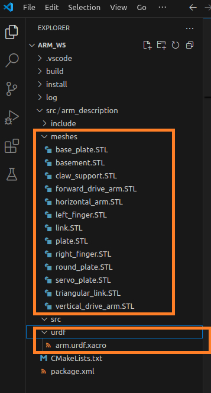
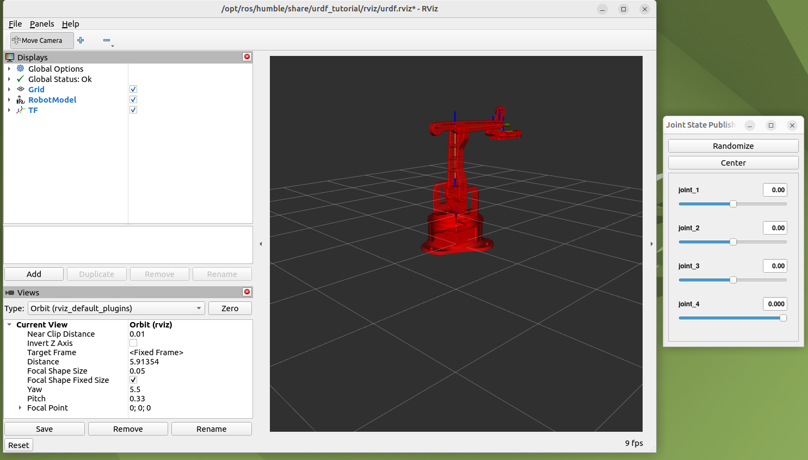

# Clase Robot URDF


El objetivo de la presente práctica es conocer los conceptos básico de ROS2 Humble (paquete, nodo, topicos, info y rqt), importar los modelos y crear un launcher para la simulación del comportamiento de un robot móvil

### Instalación de paquete Turtlesim


Abre una terminal y sigue los siguientes pasos.

Presione 
```bash
Crtl + alt + t

```
Crear un directorio llamado arm_ws y un sub directorio src
```bash
mkdir -p arm_ws/src
```
Abrir carpeta difrobot_ws:
```bash
cd arm_ws/
```
Compilar proyecto
```bash
colcon build
```

revisar si se crearon las carpetas build, install log y src
```bash
ls
```
Cambiar a directorio src
```bash
cd src/
```

Crear paquete difrobot_py_examples
```bash
ros2 pkg create --build-type ament_python arm_py_examples
```
Compilar proyecto
```bash
cd ..
```
```bash
colcon build
```

Crear paquete difrobot_description
```bash
cd src/
```
```bash
ros2 pkg create --build-type ament_cmake arm_description
```
Compilar proyecto
```bash
cd ..
```
```bash
colcon build
```


En la terminal buscar la ruta difrobot_wsy ejecutar VsCode:
```bash
cd arm_ws
```
```bash
code .
```
En Vscode seleccionar la ruta arm_ws/src/arm_description/ crear las carpetas y el archivo mostrado en  la imagen:
<p align="center">

</p>

En el archivo difrobot.urdf.xacro en Visual Studio code, escriba los siguientes comandos:
```xml
<?xml version="1.0"?>
<robot xmlns:xacro="http://www.ros.org/wiki/xacro" name="arm">

   <!-- Links  base-->
    <link name="world"/>

    <link name="base_link">
        
        <visual>
            <origin rpy="0 0 0" xyz="0 0 0"/>
            <geometry>
               
                <mesh filename="package://arm_description/meshes/basement.STL" scale="0.01 0.01 0.01"/>
            </geometry>
        </visual>
       
    </link>

     <!-- Joint base_link -->  
     <joint name="virtual_joint" type="fixed">
        <parent link="world"/>
        <child link="base_link"/>
        <origin xyz="0 0 0" rpy="0 0 0"/>
    </joint> 

</robot>
```
En el archivo CMAKELists agrege el comando con la ruta de archivos meshes y urdf:

```c++
install(
  DIRECTORY meshes urdf
  DESTINATION share/${PROJECT_NAME}

)
```
Compilar el paquete difrobot_description en la ruta difrobot_ws
```bash
cd arm_ws
```
```bash
colcon build
```
En una nueva terminal actualizar el bash:
```bash
. install/setup.bash
```
instalar en el proyecto el paquete urdf-tutorial
```bash
sudo apt-get install ros-humble-urdf-tutorial
```
Ejecutar RVIZ con el modelo difrobot.urdf.xacro:
```bash
ros2 launch urdf_tutorial display.launch.py model:=/home/ubuntu/arm_ws/src/arm_description/urdf/arm.urdf.xacro
```

<p align="center">

</p>


### Compilar proyecto URDF

Clonar repositorio

```bash
sudo apt-get install git
```
```bash
git clone --branch Robot-ARM --single-branch https://github.com/xXThanatosXx/RoboticaIndustrial.git

```

```bash
mv ~/RoboticaIndustrial/arm_ws ~/arm_ws
```

```bash
cd arm_ws
```

```bash
colcon build --cmake-clean-cache
```
Instalar dependencias
```bash
rosdep install --from-paths src --ignore-src -r -y
```

