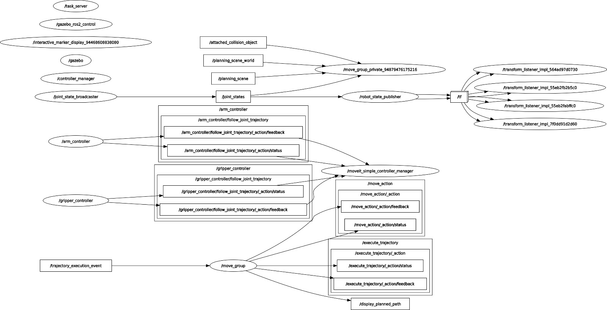

# Clase Robot ARM Task Moveit.


El objetivo de la presente práctica es conocer los conceptos básico de ROS2 Humble (paquete, nodo, topicos, info y rqt), importar los modelos y crear un launcher para la simulación del comportamiento de un robot móvil

# instalar paquetes

```bash
sudo apt-get update && sudo apt-get install -y \
     ros-humble-joint-state-publisher-gui \
     ros-humble-gazebo-ros \
     ros-humble-xacro \
     ros-humble-ros2-control \
     ros-humble-moveit \
     ros-humble-ros2-controllers \
     ros-humble-gazebo-ros2-control 
```
```bash

sudo apt-get update && sudo apt-get install -y \
     libserial-dev \
     python3-pip
```
```bash

pip install pyserial
```

Instalar paquete de planeadores de trayectoria

```bash
sudo apt-get install ros-humble-moveit-planners 
```


# Clonar repositorio

```bash
git clone --branch Robot-ARM-Action --single-branch https://github.com/xXThanatosXx/RoboticaIndustrial.git
```

```bash
mv ~/RoboticaIndustrial/arm_ws ~/arm_ws
```
```bash
cd arm_ws
```
```bash
rosdep install --from-paths src --ignore-src -r -y
```
```bash
colcon build --cmake-clean-cache
```
### Modificar el registro de Gazebo
```bash
sudo nano /usr/share/gazebo/setup.sh
```

Remplezar las lineas

```bash
export GAZEBO_MASTER_URI=""
export GAZEBO_MODEL_DATABASE_URI=""
```

Modificar el registro de gazebo 11

```bash
sudo nano /usr/share/gazebo-11/setup.sh
```

```bash
export GAZEBO_MASTER_URI=""
export GAZEBO_MODEL_DATABASE_URI=""

```bash
source /usr/share/gazebo-11/setup.sh
```


### Control articular en simulación 


### Actividad UNO: Nodo Moveit 
Presione 
```bash
Crtl + alt + t
```

cambiar de directorio de trabajo
```bash
cd arm_ws
```
```bash
 . install/setup.bash 
```
Ejecutar:
```bash
ros2 launch arm_description gazebo.launch.py 
```
```bash
ros2 launch arm_controller controller.launch.py 
```
lanzar nodo moveit
```bash
ros2 launch arm_moveit moveit.launch.py 
```

### Actividad DOS: Action server task

Abre una terminal y sigue los siguientes pasos.

Presione 
```bash
Crtl + alt + t
```
cambiar de espacio de trabajo
```bash
cd arm_ws
```
```bash
 . install/setup.bash 
```

Activar nodo Gazebo
```bash
ros2 launch arm_description gazebo.launch.py 
```

En otra terminarl lanzar nodo control
```bash
ros2 launch arm_controller controller.launch.py 

```
En otra terminal lanzar nodo moveit
```bash
ros2 launch arm_moveit moveit.launch.py 

```

En otra terminar lanzar en nodo de interacción remota
```bash
ros2 launch arm_remote remote_interface.launch.py 

```
En una nueva terminal activar las trayectorias predefinidas "0,1,2"
```bash
ros2 action send_goal /task_server arm_msgs/action/ArmTask "task_number: 2" 

```

Graficar los nodos y tópicos del robot
```bash
rosgraph
```
### Actividad Tres: Mover el robot con los Slider

```bash
ros2 launch arm_description gazebo.launch.py
```
```bash
ros2 launch arm_controller slider_controller.launch.py
```

<p align="center">

</p>