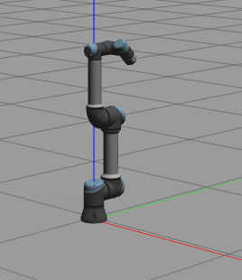

<h1 align="center">Robot UR en ROS 2 Humble</h1>
Compilación de proyecto robot UR


## Recursos Adicionales

Para complementar tu aprendizaje en el curso de Robótica Industrial, aquí tienes algunos enlaces a recursos externos que podrían ser de tu interés:

- [Repositorio de Universal Robots](https://github.com/UniversalRobots/Universal_Robots_ROS2_Description)
- [Repositorio de Universal robots Gazebo Ros2](https://github.com/UniversalRobots/Universal_Robots_ROS2_Gazebo_Simulation)
- [Documentación Oficial de Universal Robots Driver](https://github.com/UniversalRobots/Universal_Robots_ROS2_Driver/tree/humble)


### Instalación de Dependencias


Abre una terminal y sigue los siguientes pasos.

Presione 
```bash
Crtl + alt + t
```
Paso 1 - Configurar proyecto:
```bash
mdir -p colcon_ws/src
```
```bash
cd colcon_ws/src
```
Paso 2 - Configura tus Keys:
```bash
git clone -b humble https://github.com/UniversalRobots/Universal_Robots_ROS2_Description.git
```
```bash
git clone -b humble https://github.com/UniversalRobots/Universal_Robots_ROS2_Gazebo_Simulation.git
```

```bash
rosdep update && rosdep upgrade --ignore-src  --from-paths . -y
```
```bash
cd colcon_ws
```
```bash
colcon build --symlink-install
```

```bash
source /opt/ros/humble/setup.bash
```

```bash
source install/setup.bash
```

Paso 3 - Instalar Driver:

```bash
sudo apt-get install ros-humble-ur
```

## Lanzar simulador
En nueva terminal ejecutar los siguientes comandos en el espacio de trabajo principal

Lanzar simulacion en Gazebo
```bash
source install/setup.bash
```
```bash
ros2 launch ur_simulation_gazebo ur_sim_control.launch.py
```
Mover el robot UR con el planeador Moveit
Presione Crtl + alt + t
```bash
ros2 launch ur_simulation_gazebo ur_sim_moveit.launch.py
```

Ejecutar una trayectoria de ejemplo con UR Driver
```bash
ros2 launch ur_simulation_gazebo ur_sim_moveit.launch.py
```

