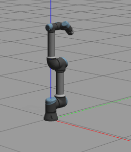

<h1 align="center">Robot UR en ROS 2 Humble</h1>
Compilación de proyecto robot UR


## Recursos Adicionales

Para complementar tu aprendizaje en el curso de Robótica Industrial, aquí tienes algunos enlaces a recursos externos que podrían ser de tu interés:

- [Repositorio de Universal Robots](https://github.com/UniversalRobots/Universal_Robots_ROS2_Description)
- [Repositorio de Universal robots Gazebo Ros2](https://github.com/UniversalRobots/Universal_Robots_ROS2_Gazebo_Simulation)
- [Documentación Oficial de Universal Robots Driver](https://github.com/UniversalRobots/Universal_Robots_ROS2_Driver/tree/humble)
- [Documentación Oficial de Universal Robots URCAPS](https://docs.universal-robots.com/Universal_Robots_ROS2_Documentation/doc/ur_client_library/doc/setup/ursim_docker.html)
- [Documentación Oficial de Universal Robots URCAPS](https://docs.universal-robots.com/Universal_Robots_ROS2_Documentation/doc/ur_client_library/doc/setup/robot_setup.html#install-urcap)
- [Repositorio Oficial de Universal Robots URCAPS](https://github.com/UniversalRobots/Universal_Robots_ExternalControl_URCap/releases)

 


### Instalación de Dependencias


Abre una terminal y sigue los siguientes pasos.

Presione 
```bash
Crtl + alt + t
```
Paso 1 - Configurar proyecto:
```bash
mkdir -p colcon_ws/src
```
```bash
cd colcon_ws/src
```
Paso 2 - Configura tus Keys:
```bash
git clone -b humble https://github.com/UniversalRobots/Universal_Robots_ROS2_Description.git
```
```bash
git clone -b humble https://github.com/UniversalRobots/Universal_Robots_ROS2_Gazebo_Simulation.git
```

```bash
rosdep update 
```
```bash
rosdep install --from-paths . --ignore-src -r -y
```
```bash
cd colcon_ws
```
```bash
colcon build --symlink-install
```

```bash
source /opt/ros/humble/setup.bash
```

```bash
source install/setup.bash
```

Paso 3 - Instalar Driver:

```bash
sudo apt-get install ros-humble-ur
```

## Lanzar simulador
En nueva terminal ejecutar los siguientes comandos en el espacio de trabajo principal

Lanzar simulacion en Gazebo
```bash
source install/setup.bash
```
```bash
ros2 launch ur_simulation_gazebo ur_sim_control.launch.py
```
Mover el robot UR con el planeador Moveit
Presione Crtl + alt + t
```bash
ros2 launch ur_simulation_gazebo ur_sim_moveit.launch.py
```

Paso 4 - instalar paquete en el workspace Colcon_ws/src

```bash 
cd ~/colcon_ws/src
```
Clonar el repositorio  
```bash
git clone -b humble https://github.com/UniversalRobots/Universal_Robots_ROS2_Driver.git  
```  
Volver a la raíz del workspace  
```bash
cd ~/colcon_ws  
```
Importar dependencias  
```bash
vcs import src --skip-existing --input src/Universal_Robots_ROS2_Driver/Universal_Robots_ROS2_Driver-not-released.${ROS_DISTRO}.repos  
```

Instalar dependencias con rosdep  
```bash
rosdep update  
rosdep install --ignore-src --from-paths src -y  
```  
Compilar el workspace  
```bash
colcon build --cmake-args -DCMAKE_BUILD_TYPE=Release  
```  
Cargar el entorno  
```bash
source install/setup.bash
```
Paso 5 - Obtener la IP de tu VM de ROS2
```bash
hostname -I  
```
### IPs en tu configuración
- VM de ROS2: 192.168.19.128
- VM de URSim: 192.168.19.131
  
Configuración en URSim (Polyscope) con URCAPS
Host IP: 192.168.19.128
Port: 50002 
# Test de conexión Polyscope
- Primero ubique el robor en la posición segura Home (0,-90,0,-90,0,0) grados.
- Luego modifique la ip del URCaps control externo con la IP del host.
  


- Ponga en modo robot real y presione el botón de play.
Ejecute el comando conexión en ros2
``` bash
ros2 launch ur_robot_driver ur_control.launch.py ur_type:=ur3 robot_ip:=192.168.19.131 reverse_ip:=192.168.19.128 launch_rviz:=true
```
Abra otra consola de comandos y ejecute el comando de movimientos básicos
```bash
ros2 launch ur_robot_driver test_scaled_joint_trajectory_controller.launch.py
```
Abra una nueva terminal para ejecuar moveit
```bash
ros2 launch ur_moveit_config ur_moveit.launch.py ur_type:=ur3 launch_rviz:=true
```
Verificar que el programa external model se esta ejecutando
``` bash
ros2 topic echo /io_and_status_controller/robot_program_running
```
```bash
ros2 control list_controllers
```
# Configuración robot real
1. Instalar URCAPS
2. Extraer configuración del robot

```bash
ros2 launch ur_calibration calibration_correction.launch.py robot_ip:=<IP_DEL_ROBOT_REAL> target_filename:="${HOME}/my_robot_calibration.yaml"
```
3. lanzar el driver con la configuración del robot
```bash
ros2 launch ur_robot_driver ur_control.launch.py ur_type:=ur3 robot_ip:=<IP_DEL_ROBOT_REAL> reverse_ip:=192.168.19.128 kinematics_params_file:="${HOME}/my_robot_calibration.yaml" launch_rviz:=true
```
Lanzar el driver sin la configuración del robot
```bash
ros2 launch ur_robot_driver ur_control.launch.py ur_type:=ur3 robot_ip:=<IP_DEL_ROBOT_REAL> reverse_ip:=192.168.19.128 launch_rviz:=true
```



