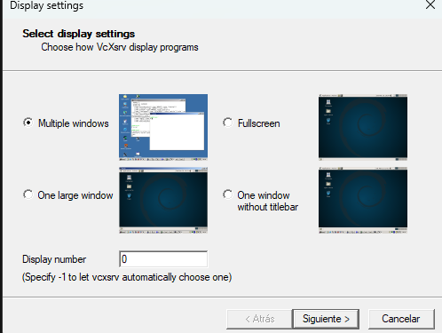
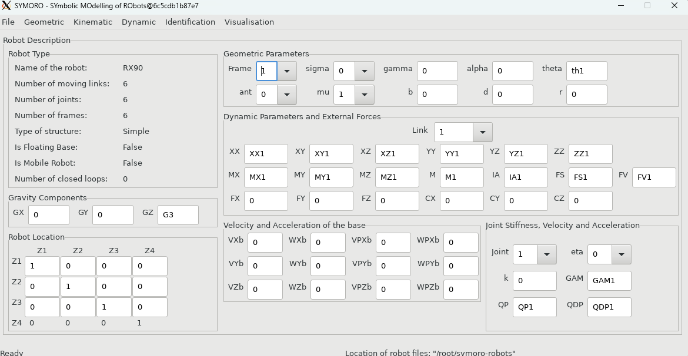

<h1 align="center">Symoro Install on Docker</h1>
Creación de contenedor para Software Symoro end Docker.


## Recursos Adicionales

Para complementar tu aprendizaje en el curso de Robótica Industrial, aquí tienes algunos enlaces a recursos externos que podrían ser de tu interés:

- [Repositorio de imagen Symoro](https://hub.docker.com/r/baaluidnrey/symoro)
- [Instalador de Xming](https://sourceforge.net/projects/xming/)

### Confiuración de Xming
Instalar Xming y ejecutar Xlaucnh, configurar Display number en 0 como se observa en la imagen.



### Confiuración de Symoro en Docker.
Abre una terminal en Docker Hub.

Paso 1 - Clonar la imagen de Symoro
```bash
docker pull baaluidnrey/symoro
```
Paso 2 - Crear una carpeta en el computador host de Windows de la siguiente forma. Nota cambiar el nombre de usuario de su equipo en la ruta: 
```bash
C:\Users\Usuario\Documents\RobotsSymoro
```

Paso 3 - Crear contenedor en Docker, con carpeta destino en host: 

```bash
docker run -d `
  -e DISPLAY=host.docker.internal:0.0 `
  -e NO_AT_BRIDGE=1 -e LIBGL_ALWAYS_INDIRECT=1 `
  -v "C:\Users\Usuario\Documents\RobotsSymoro:/root/symoro-robots" `
  --name symoro `
  --restart unless-stopped `
  baaluidnrey/symoro tail -f /dev/null
```
A continuación, se muestra la ventana de Symoro. Todos los archivos se almacenan en la carpeta compartida con el host.




Paso 4 - Inicio de contenedor Symoro
```bash
docker start symoro
```
Paso 5 - Detener contenedor Symoro

```bash
docker stop symoro
```